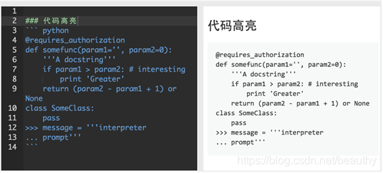
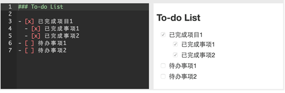
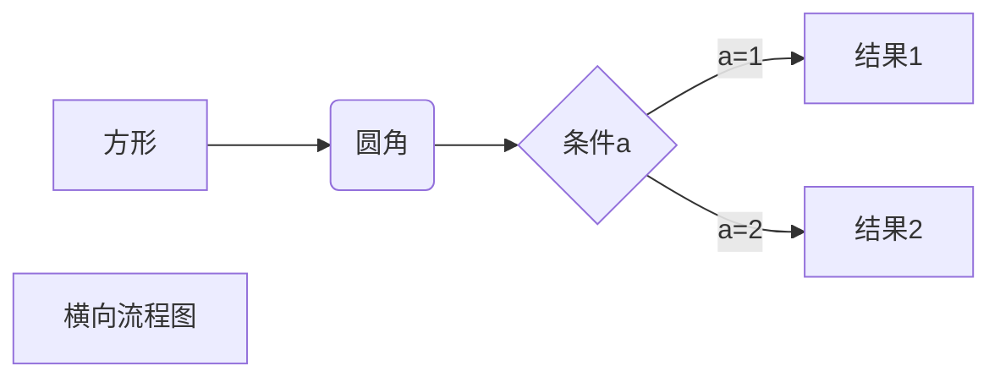
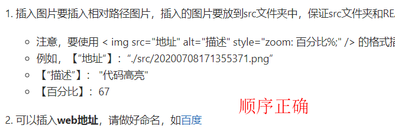
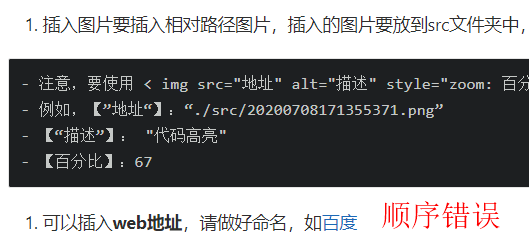

# 如何写一篇好用的README.md


Table of Contents
=================

   * [如何写一篇好用的README.md](#如何写一篇好用的readmemd)
   * [Table of Contents](#table-of-contents)
      * [1. README.md的必要性](#1-readmemd的必要性)
      * [2. 完整的README包括哪些内容](#2-完整的readme包括哪些内容)
      * [3. 其他关键信息](#3-其他关键信息)
      * [4. Markdown语言能做什么？](#4-markdown语言能做什么)
      * [团队规范](#团队规范)

**工具**

**Typora 0.9.98**

## 1. README.md的必要性

因为README的编写，过了很长时间后，你仍然知道代码里，当初你写了什么；

因为README的编写，其他人看你的代码不需要那么费劲；

因为README的编写，你代码的质量就大大的提高；

因为README的编写，你的语言水平就大大的提高了。

## 2. 完整的README包括哪些内容

README文件通常采用Markdown语言

- [ ] 软件定位，软件的基本功能；
- [x] 运行代码的方法：安装环境，启动命令；
- [x] 简要的使用说明；
- [x] 代码目录结构说明，更详细点可以说明软件的基本原理；
- [x] 常见问题说明。

## 3. 其他关键信息

- [x] 项目和所有子模块和库的名称；
- [x] 对所有子模块和库的描述；
- [x] 如何使用某库；
- [x] 版权信息和许可信息；
- [x] 抓取文档指令；
- [x] 安装、配置和运行程序的指导；
- [x] 抓取最新代码和构建他们的说明（或快速概述和阅读Install）
- [x] 作者列表；
- [x] 提交bug；
- [x] 其他联系信息；（电子邮箱，网站，公司名称，地址）
- [x] 一个简短的历史纪录；
- [x] 法律声明。 

## 4. Markdown语言能做什么？

- 代码高亮



- to-do-list

  

- 绘制流程图，序列图，甘特图，表格



- 插入数学公式
<a name="length" id="length">`https://baidu.com`</a>


## 5. 团队规范

1. **插入图片**要插入相对路径图片，插入的图片要放到src文件夹中，保证src文件夹和README.md文件在同一层级，此时本地文件和github/gitlab都可以使用
   - 注意，要使用 `` 的格式插入图片，包括【“地址”】【“描述”】【百分比】
   - 例如，【”地址“】：“./src/20200708171355371.png”
   - 【“描述”】： "代码高亮"
   - 【百分比】：67
   
2. 可以插入**web地址**，请做好命名，如[百度](https://baidu.com)

3. **toc插入**
   - > 本地的md文件可以直接在开头添加[TOC],但是github/gitlab不可以
   - 使用[gh-md-toc](https://github.com/ekalinin/envirius/blob/24ea3be0d3cc03f4235fa4879bb33dc122d0ae29/README.md)工具产生toc内容并粘贴到md文件开头，推荐使用linux/mac系统
   - ps：在本地md文件里，ctrl+click转到位置； 在github/gitlab里，直接click转到位置

4. **页内跳转**
   - git常用的页面跳转是a）跳转按钮```[跳转按钮](#length)``` b）跳转位置```<a name="length">`https://baidu.com`</a>```
   - Typora常用的页面跳转是a）跳转按钮```[跳转按钮](#length)``` b）跳转位置```<a id="length">`https://baidu.com`</a>```
   - 所以为了本地文件；github/gitlab同时生效，请: ```<a name="length" id="length">`https://baidu.com`</a>```
5. 如果需要添加**tag**时，例如
6. 如果要使用emoji，请不要在标题中插入 eg:smile_cat:, 因为gh-md-toc工具和emoji兼容仍然存在local file和github有差异的地方
- [emoji表情大全](https://www.webfx.com/tools/emoji-cheat-sheet/)
  - [emoji表情大全](https://www.webfx.com/tools/emoji-cheat-sheet/)
  
7. **树结构插入**
   - tree 工具安装（centos）```sudo yum -y install tree```
   - **`tree`常用命令**
   - tree -a 显示所有
   - tree -d 只显示文档夹
   - tree -L n 显示项目的层级，n表示层级数，比如想要显示项目三层结构，可以用tree -l 3；
   - tree -I pattern 用于过滤不想要显示的文档或者文档夹。比如你想要过滤项目中的 node_modules 文档夹，可以使用 tree -I “node_modules”；
   - tree > tree.md 将项目结构输出到 tree.md 这个文档
8. 不要使用Typora里面的下划线
9. **有序列表下插入无序列表时中间不能有换行**
   - 无换行：
   - 有换行:
10. **无序列表之前不要有换行**
    [下载地址](#length)
    -    good
11. good
    1. 
    2. 

​    

​    


## References

[主要框架](https://blog.csdn.net/beauthy/article/details/107210130)

